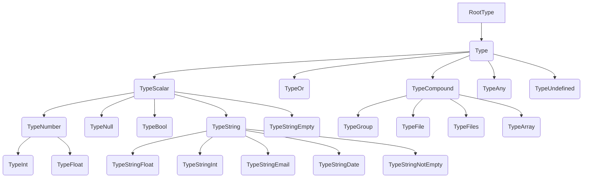

# Vivy

<pre align="center">
🧪 Working in Progress
</pre>

PHP validation engine

🚀 Blazingly fast  
🦾 Type safe  
🎨 Custom validators  
🧩 Plugin first approach  

## Installation

Require this package with composer.

```shell
composer require kedniko/vivy
```

# StandardLibrary Plugin


